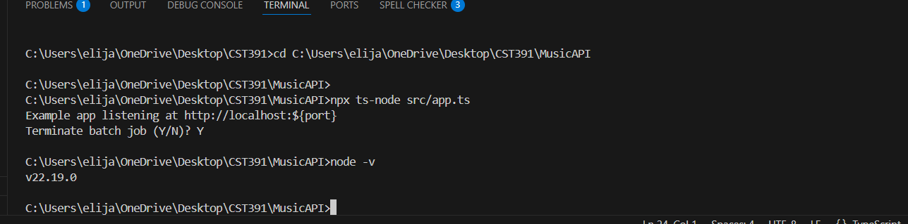
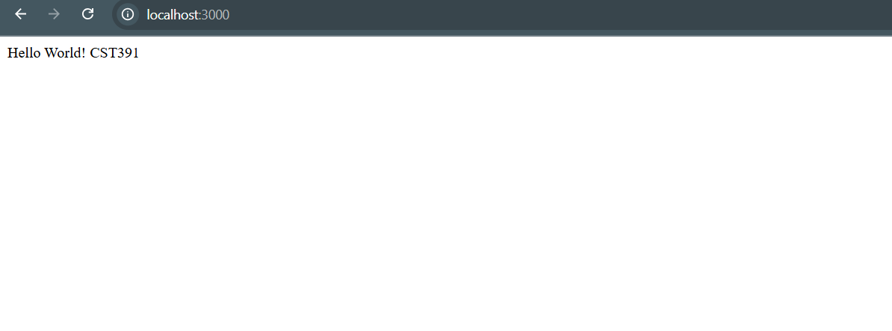
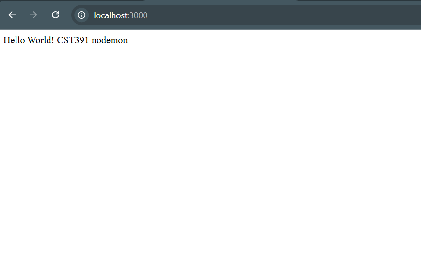
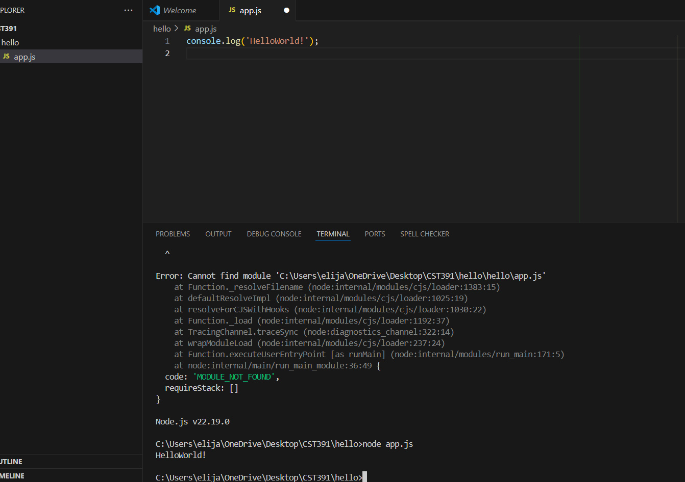
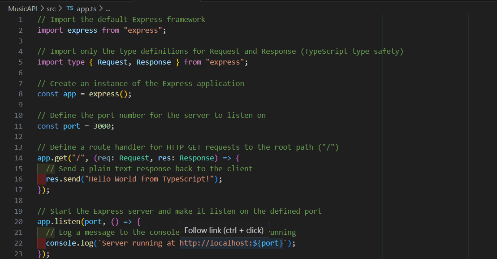

# Activity 0

- Author: Elijah Kremer
- Date: 6 Sep 2025

## Introduction

- This is **Activity 0** With this activity we have begun our progress for this course. set up the necessary software for development, and created `hello`, `helloex`, and started `MusicAPI`. 

- This activity will install the following tools to execute a simple **Hello World** [Representational State Transfer (RESTful)](https://en.wikipedia.org/wiki/REST) [Application Programming Interface (API)](https://en.wikipedia.org/wiki/API)
     - [Express](https://expressjs.com/) - backend web application framework for building RESTful APIS
     - [NodeJS](https://nodejs.org/en) - open-source, cross-platform JavaScript runtime environment allowing developers to create servers, web applications, command line tools and scripts
     - [Visual Studio Code](https://code.visualstudio.com/) - integrated development environment, code editor
     - [TypeScript](https://www.typescriptlang.org/) - Adds types to JavaScript
- Three applications will be executing, node, express and TypeScript application


Three applications will be executing, node, express and TypeScript application


##  Images
 included are the Activity 0 Images.

 ## Installation Verification
 

## NodeJS "Hello World" Application

- The following commands execute the **Hello World** Application
```
cd hello
gedit app.js &
node app.js
```
## NodeJS with TypeScript "Hello TypeScript" Application

```
mkdir MusicAPI
cd MusicAPI/
sudo npm init     <- accept all the defaults
sudo npm i express
sudo npm i --save-dev typescript @types/express
mkdir src
cd src/
cp ../../../../docs/topic01/activity0_app.ts app.ts
sudo npm i typescript@latest -g
touch tsconfig.json
sudo tsc --init
sudo npm install -g ts-node
sudo ts-node app.ts 
```

- Hello World localhost



- ## Express "Hello Express" Application

```
cd helloex
npm init     <- accept all the defaults
sudo npm install express
node app.js
sudo npm install -g nodemon
sudo nodemon app.js
```
_________________

- ### This images shows the `nodem` application executing on port 3000

_____________________

- ### This images shows the `app.js` file 

_____________________

- ### This images shows the `app.ts` file

_________________

## Conclusion

- Activity 0 shows how to install NodeJS, Express, Visual Studio Code and TypeScript.  Also three programs were executed:
     - NodeJS **Hello World** Application
     - Express **Hello Express** Application
     - TypeScript **Hello TypeScript** Application
