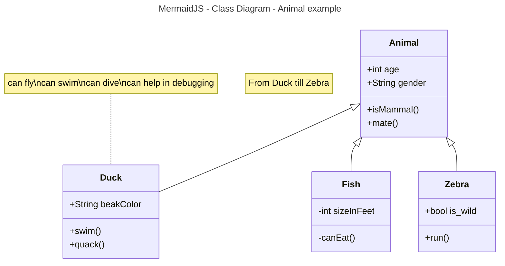

# Activity 1

## Introduction

- This is **Activity 1** jalsdkfjasljf

## Fruit List

1. pears
2. cherries
3. apples
     1. red
     2. yellow
     3. green
4. oranges

## Fruit List

- pears
- cherries
- apples
     - red
     - yellow
     - green
- oranges


## Links / Images

- [fred](https://gitlab.com/bobby.estey/wikibob/-/blob/master/README.md)
- [Grand Canyon University](https://www.gcu.edu/)


## Tables
|First Name|Last Name|
|--|--|
|Elijah|Kremer|
|John|Doe|

```java
// Java Example
public class CodeBlock {
    public static void main(String[] args) {
        System.out.println("Code Block Example");
    }
}
```

