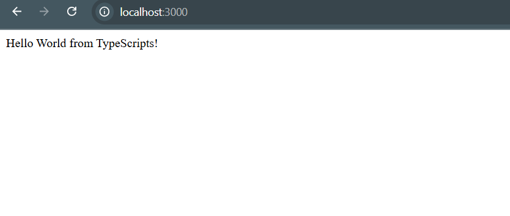
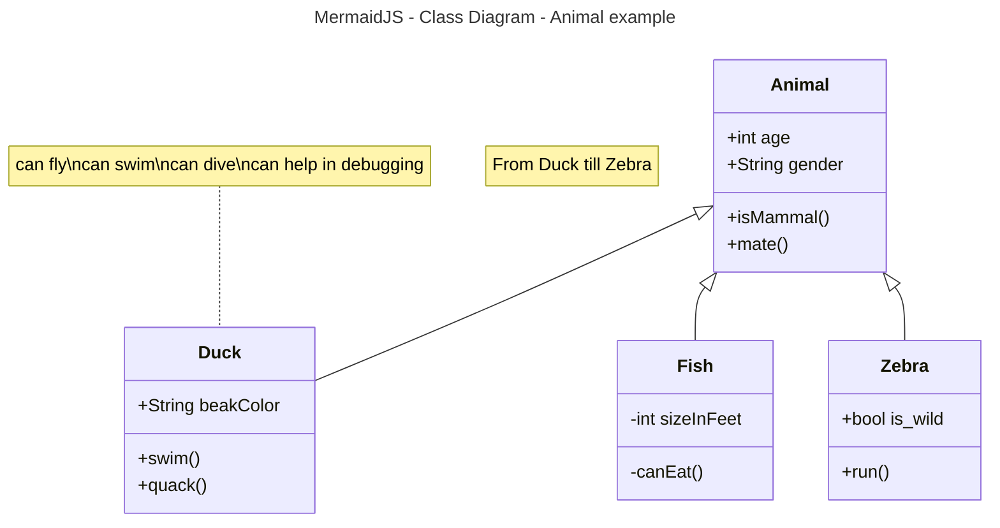

# Activity 0

## Introduction

- This is **Activity 0** With this activity we have begun our progress for this course. set up the necessary software for development, and created `hello`, `helloex`, and started `MusicAPI`. 


## Links / Images
these are the tutorial files that were demonstrated for me.

Also included are the Activity 0 Images.

- [fred](https://gitlab.com/bobby.estey/wikibob/-/blob/master/README.md)
- [Grand Canyon University](https://www.gcu.edu/)





_________________


## Tables
|First Name|Last Name|
|--|--|
|Elijah|Kremer|
|John|Doe|

```java
// Java Example
public class CodeBlock {
    public static void main(String[] args) {
        System.out.println("Code Block Example");
    }
}
```

