# Activity 1

- Author: Elijah Kremer
- Date:  5 September 2025
- Course:  CST-391
## Introduction
This activity is a web server created using `Node.js` to demonstrate how to use REST API functions. It will connected to a MySQL database to manage the data. The web server will receive a GET, POST, PUT, or DELETE request from a browser or postman. Once it receives these request it will display data it was requested or complete an action that was request such as inputting a new item into the database.

---
## Summary

Activity 1 is a sample application designed to interact with a MySQL database, showcasing how backend services can be structured using a Model-View-Controller (MVC) architecture.
- Model: Handles data logic and communicates directly with the database.
- View: Represents the user interface — what users see and interact with.
- Controller: Acts as the intermediary, managing application flow and coordinating between the model and view.
This project leverages a variety of tools and technologies to demonstrate clean architecture, modular design, and effective data handling.
    - [Node JS](https://nodejs.org/en)
    - [Node Package Manager](https://www.npmjs.com/)
    - [Express API](https://expressjs.com/en/api.html)
    - [TypeScript](https://www.typescriptlang.org/) 
    - [MySQL](https://www.mysql.com/)

---
## Screenshots

### MySQL Database ER Diagram
This is how the MySQL database is structured for this activity.

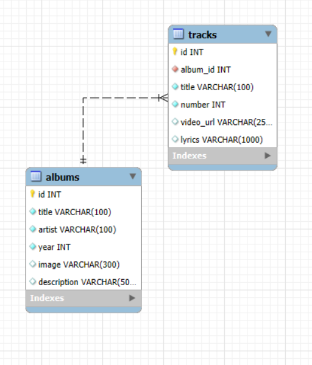

### API Endpoints

Here is a table of all the API endpoints with a postman image of the API in action:

| URL                                                     | POSTMAN IMAGE                       | BROWSER IMAGE                       | REST ACTION |
| ------------------------------------------------------- | ----------------------------------- | ----------------------------------- | ----------- |
| http://localhost:5000/albums                            | 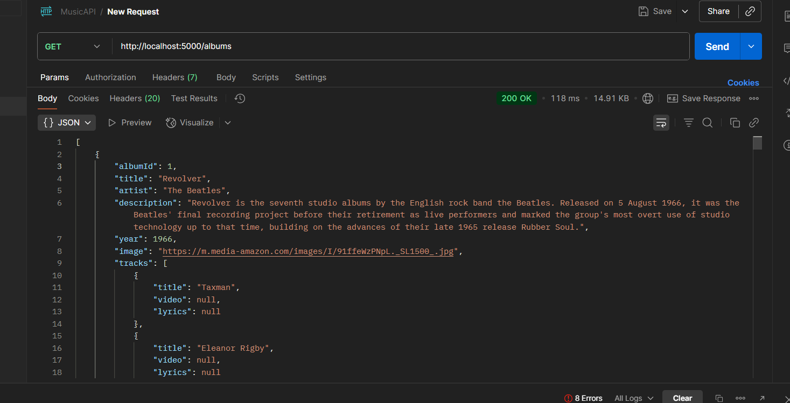 | 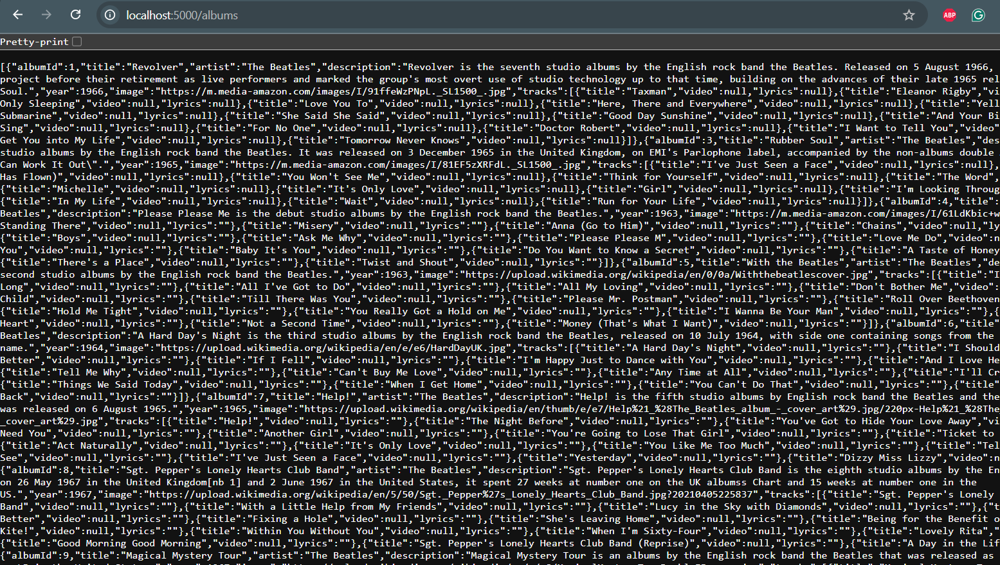| GET         |
| http://localhost:5000/artists                           | 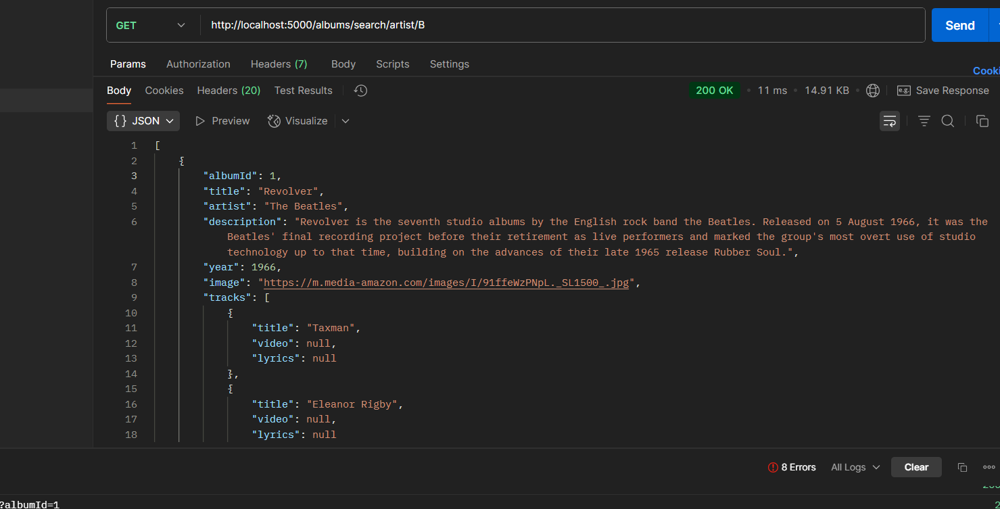 | 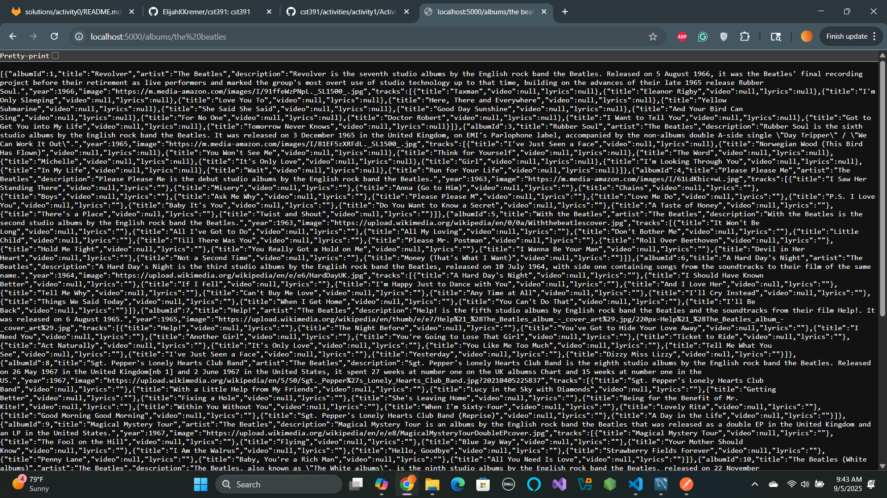 | GET         |
| http://localhost:5000/albums?albumId=1                  | 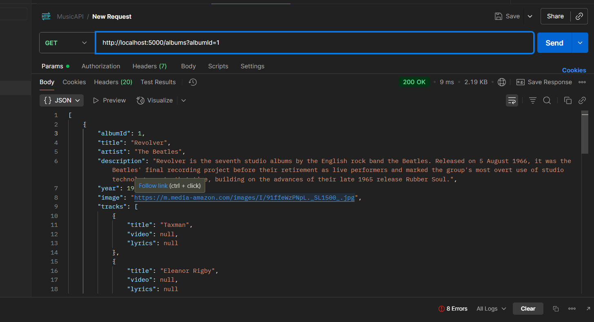 | 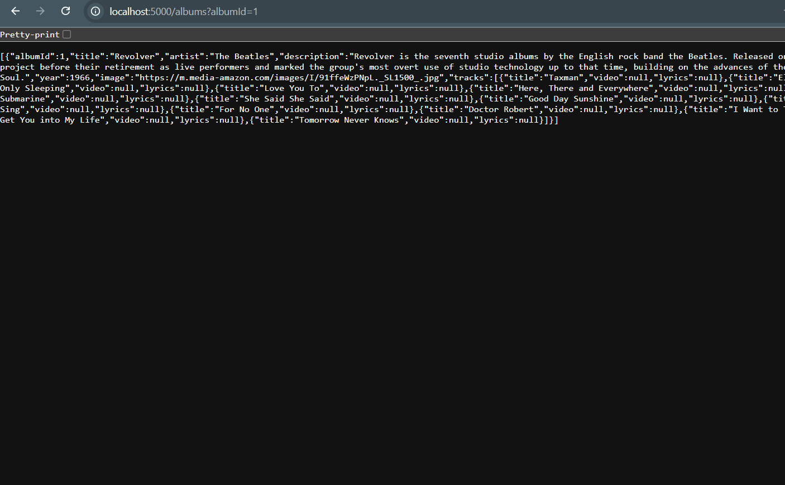 | GET         |
| http://localhost:5000/albums/search/artist/:search      | 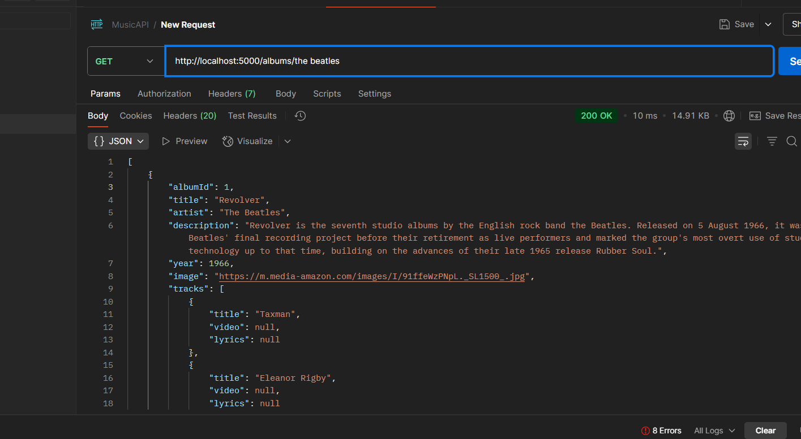 |  | GET         |
| http://localhost:5000/albums/search/description/:search | 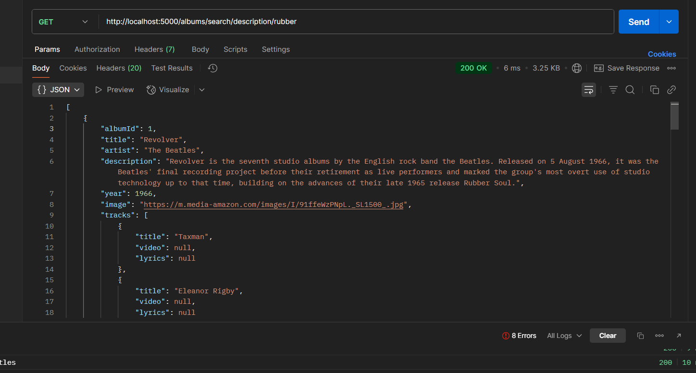 | 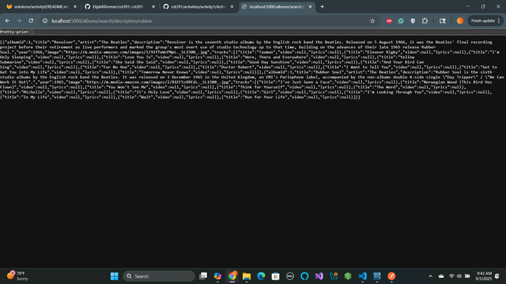 | GET         |
| http://localhost:5000/albums                            | 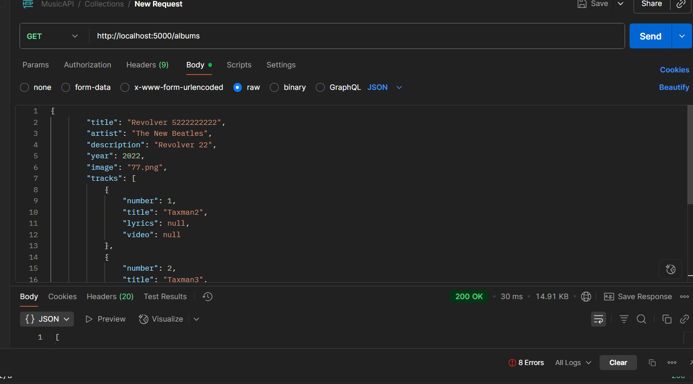 | N/A                                 | POST        |
| http://localhost:5000/albums                            | 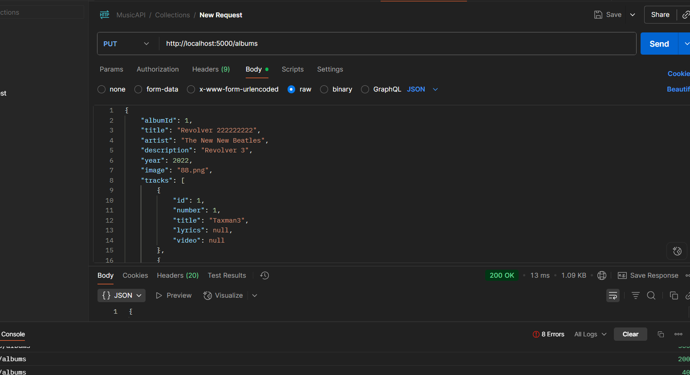 | N/A                                 | PUT         |
| http://localhost:5000/albums                            | 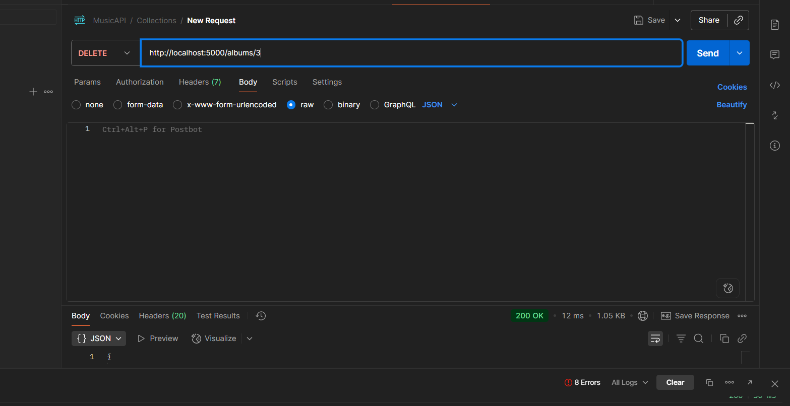 | N/A                                 | DELETE         |


### Environment Variables

```env
#MySQL Settings
MY_SQL_DB_HOST=127.0.0.1
MY_SQL_DB_USER=root
MY_SQL_DB_PASSWORD=root
MY_SQL_DB_PORT=3306
MY_SQL_DB_DATABASE=music
MY_SQL_DB_CONNECTION_LIMIT=10

#Server Settings  
PORT=5000
NODE_ENV=development
GREETING=Hello from the environment file. Be kind to the environment!
```


---
## Video Recording

- [Video Recording](https://www.loom.com/share/9558e29bfee74726897b9bd782ae8b63)

## Conculsion
Activity 1 is a sample application designed to interact with a MySQL database, showcasing how backend services can be structured using a Model-View-Controller (MVC) architecture.
- Model: Handles data logic and communicates directly with the database.
- View: Represents the user interface — what users see and interact with.
- Controller: Acts as the intermediary, managing application flow and coordinating between the model and view. This project leverages a variety of tools and technologies to demonstrate clean architecture, modular design, and effective data handling
________________________