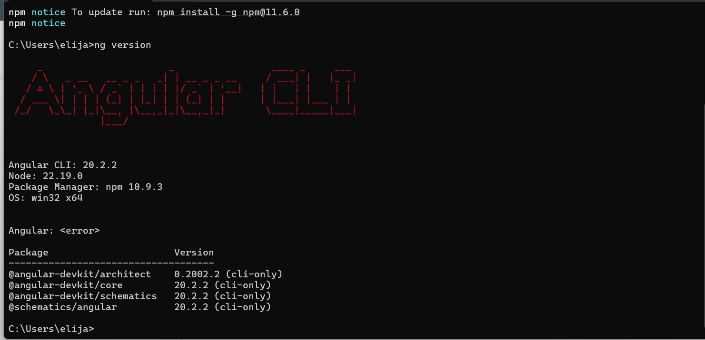
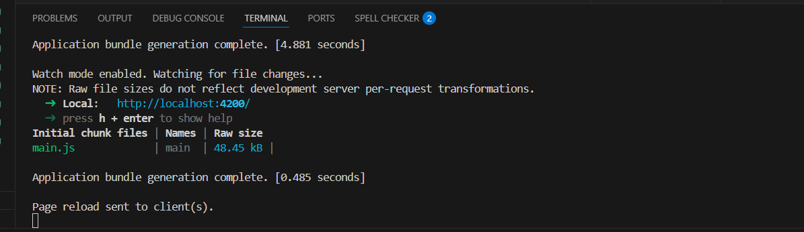
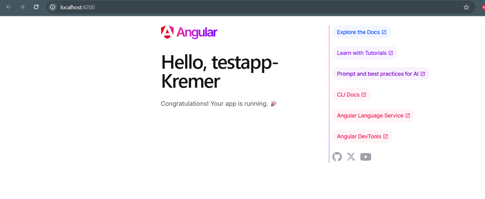
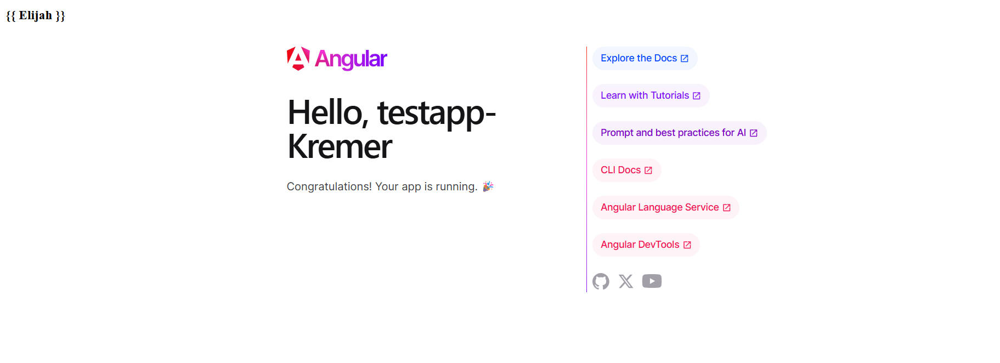

# Activity 2

- Author:  Elijah Kremer
- Date:  10 Sep 2025

## Introduction

[Angular](https://angular.dev/) is a TypeScript-based free and open-source single-page web application framework, developed by Google.  This activity will install the Angular software and start up an instance of an Angular application. A few changes to the application are made to present successful installation. 

## Activity 2 Instructions

- Install the latest version of Angular

```
npm install -g @angular/cli@latest
```

- Display the Angular Version

```
ng version
```

- Create a new Angular project, this case we will call testapp

```
ng new testapp
```

- Change directory to the new project and start the server

```
cd testapp
ng serve
```

### Angular Installation Success via Terminal:
---



### Angular Application Automatic Refresh Validation:
---
The screenshot below demonstrates the auto refresh validation for the angular test app. 



## Test Links

- http://localhost:4200

### Angular Test Application:

Below you will see the test application running with the altered title to demonstrate I successfull ran the applicaiton.

---



### Typescript and HTML Files:
---
Below you will find the screenshot of the message applied to the test app through the `app.ts` & `HTML` files.


## Conclusion

- This assignment was a straightforward introduction to Angular, similar to a "Hello World" project. I installed the Angular CLI and confirmed my setup by creating and running a test application. Through steps like generating the project, starting the server, and editing component logic, I got hands-on experience with Angular’s basic tools and structure. I also learned how components render content, how data binding works, and how to organize a workspace in VS Code. The research helped me better understand Angular’s file layout and how it builds and displays web pages. These skills will be useful for future projects and help me follow good development practices.

## Troubleshooting

|Issue|Solution|
|--|--|
|N/A|N/A|
