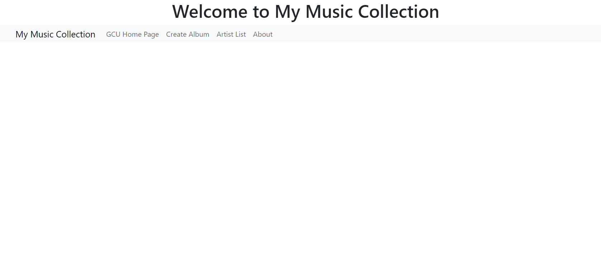
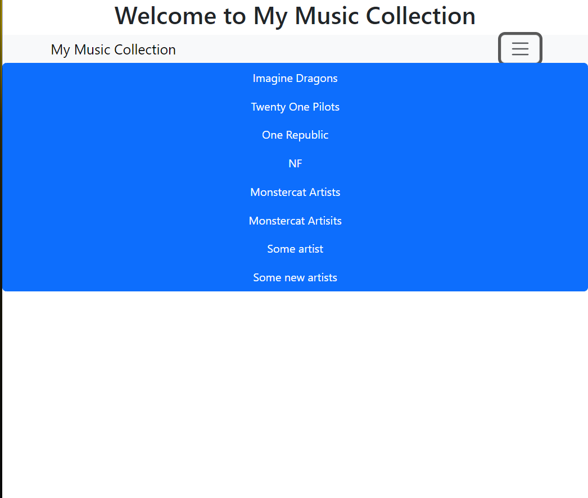
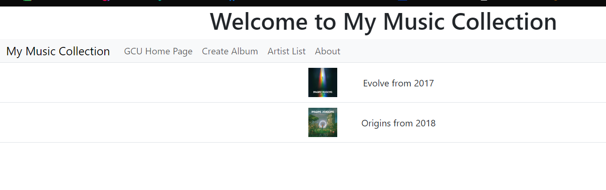
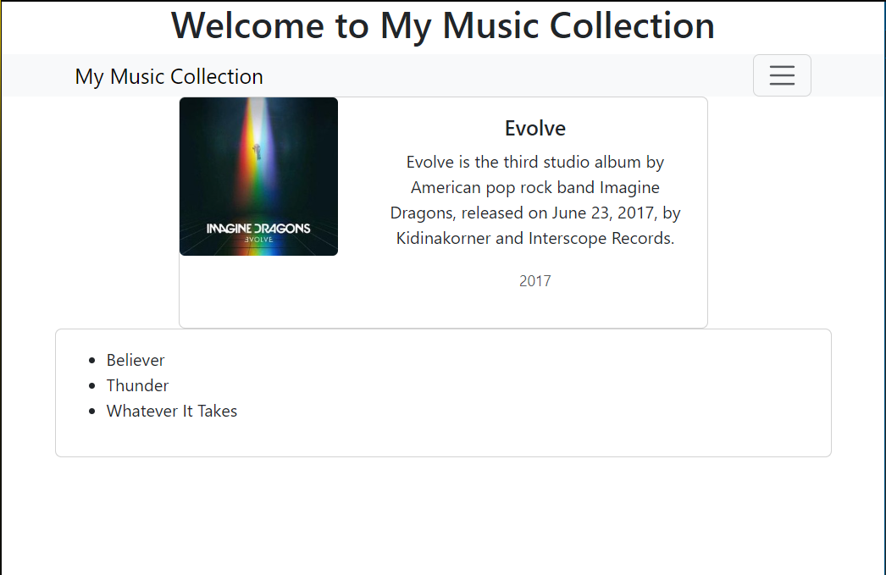
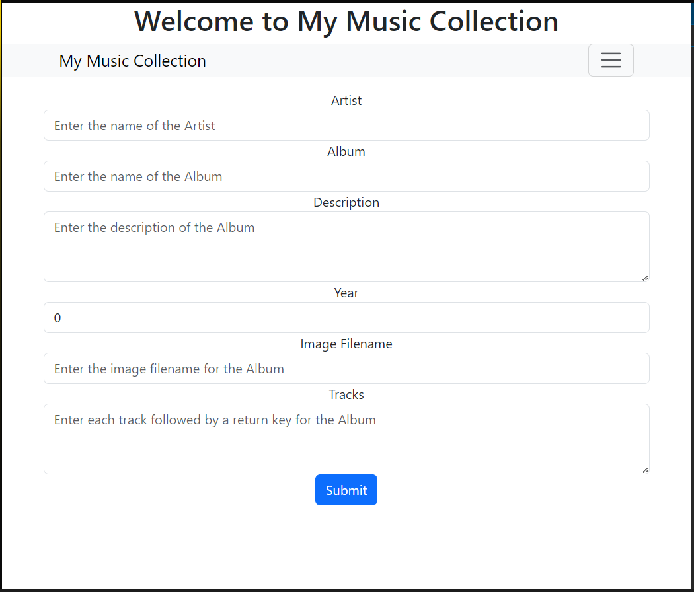

# Activity 4
### Elijah Kremer 
### 26 Sep 2025
### CST391

##  Summary
In this activity, the Music Application from Activity 3 was enhanced by integrating it with the REST API developed in Activity 1. This update replaced the static JSON data with dynamic content retrieved directly from API endpoints, allowing the application to reflect real-time data and improve overall responsiveness. By connecting to the API, the app now supports more scalable and maintainable data handling practices. This shift also aligns with modern development workflows, where client-server communication is essential for interactive web applications. The integration lays the groundwork for future features such as user-specific playlists, search functionality, and live updates

## Screenshots for Music API

Screenshot of the main application screen.

Screenshot of the artist list screen.

Screenshot of the album list screen.

Screenshot of the album display with tracks screen.

Screenshot of the add album screen.

## Research Questions
1. Research how an Angular application maintains a logged in state. How does it communicate this state to the server?

In an Angular application, user authentication can be handled using either JWT-based (stateless) or session-based (stateful) methods. Authentication tokens are typically stored in `localStorage`, `sessionStorage`, or cookies, and are sent via HTTP headers to validate requests. An `AuthService` often uses a `BehaviorSubject` to track login status, allowing components to subscribe and respond to authentication changes. With JWT, the user logs in, the server issues a token, and Angular stores and attaches it to HTTP headers for future communication. In session-based authentication, the server maintains a session and stores the session ID in cookies. Angular secures routes using `AuthGuard`, which checks authentication before navigation, ensuring secure communication through tokens, services, and guards.

## Conclusion

In this activity, the Music Application was successfully integrated with a dynamic music REST API, replacing the previously used static JSON data. This shift allows the app to fetch real-time music content, improving scalability and user experience. To further enhance the application, implementing authentication services—such as JWT or session-based login—would provide secure access control and protect user data. This aligns with modern web development standards, where secure APIs and user-specific content delivery are essential. Adding authentication also opens the door for personalized features like user playlists, favorites, and history tracking. Overall, these improvements make the app more robust, secure, and ready for production-level deployment.