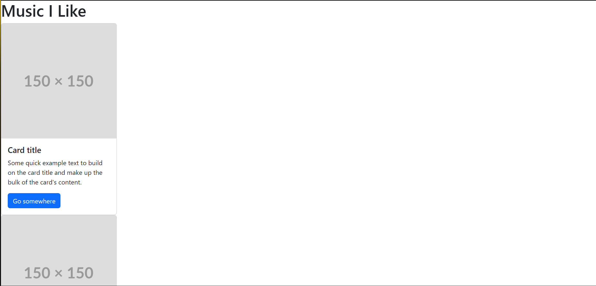
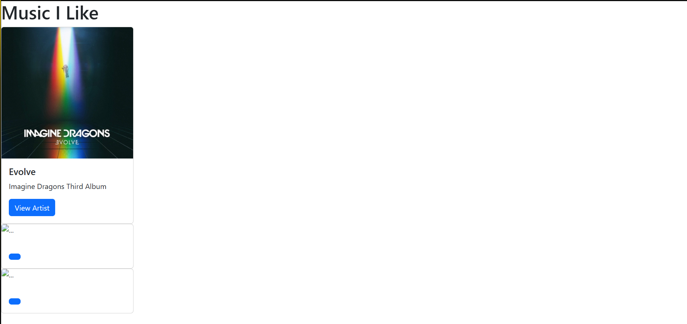
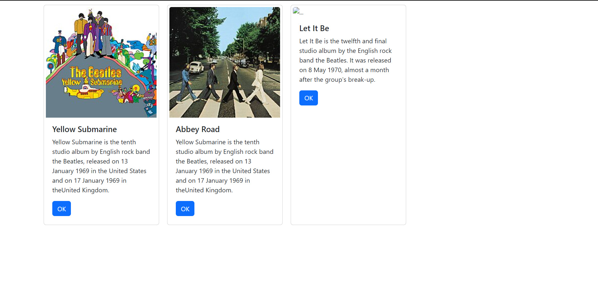
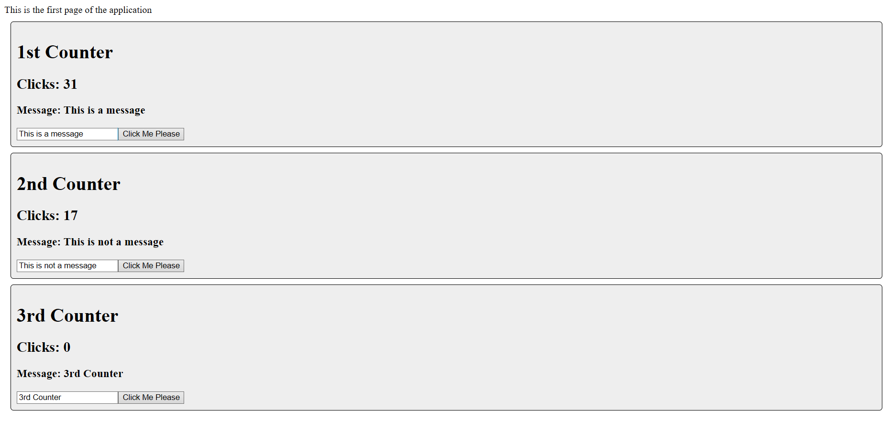

# Activity 5
## Elijah Kremer
## 4 October 2025
## CST 391

##  Project Introduction
**Goal**: Build a modular React music app with reusable components, dynamic state, and clean UI.  
**Focus**: Learn foundational React concepts through hands-on demos and stopping points.

---

## Summary
In Part 1 of the React Music App project, you laid the foundation by learning JSX rules—especially the one-parent element requirement—and rendering dynamic content. You built custom components with props, structured everything under a central App component, and reached your first stopping point with a static layout. Then you explored state management using useState, understanding how hooks evolved and how state enables interactivity. You practiced rendering lists with map(), styled your layout using CSS Flexbox, and wrapped up with a second checkpoint focused on integrating state and props. By the end, you had a modular, responsive React app with reusable components, dynamic state, and clean styling.

## Music application

This is a screenshot of the application using the default cards.

Screenshot of the application using the Card component and its parameters filled in.

<!-- Write a one paragraph summary of new lesson features that have been added -->
In this part of the lesson we learned the basics of how a React application is structure. We learned how to use JSX and how to render it's content. We learned how to use arrow functions and build custom components.

---

This is a screenshot of the music application using map to map the data to the cards.

<!-- Write a one paragraph summary of new lesson features that have been added -->
In this part of the lesson we learned how to use the map function to map objects. The map function was used to map the album data to each of the cards to display on the page. We also learned what the difference between state and props in react. The State is a JavaScript object that holds values used inside the application. Props are variables passed to a component by its parent component. Props are static and State is dynamic.

## State Changer Application

This is a screenshot of the counters from the state changer application.

## More About Component State
- **State Scope**: Local to the component unless lifted.
- **State vs Props**:
  - Props are external and immutable.
  - State is internal and mutable via hooks.

---

##  State and Props
- Validated understanding of state and props interaction.
- Result: Dynamic UI with interactive components and clean layout.

---

## Conclusion
In this activity I learned how to build a basic React application. I learned how to manipulate the state of components and how to dynamically map data into a component. I learned how to use JSX to build our web pages and how to use Props to build custom reusable components. I also learned how to change the state of the component via user input and interaction. 
- Built a modular React app with reusable components.
- Used props to pass and customize data.
- Managed state with hooks (`useState`) for interactivity.
- Rendered dynamic lists with `map()`.
- Styled layout using CSS Flexbox.
- Reached two key stopping points to validate your progress.

---

