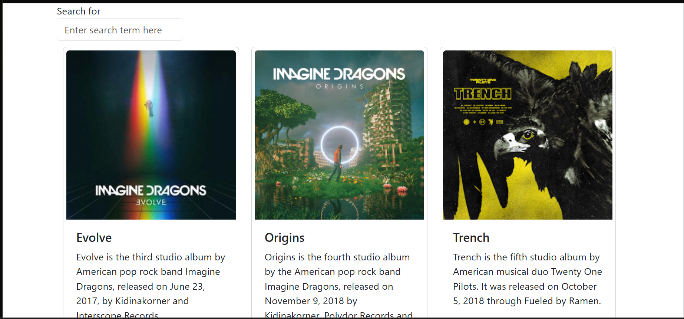
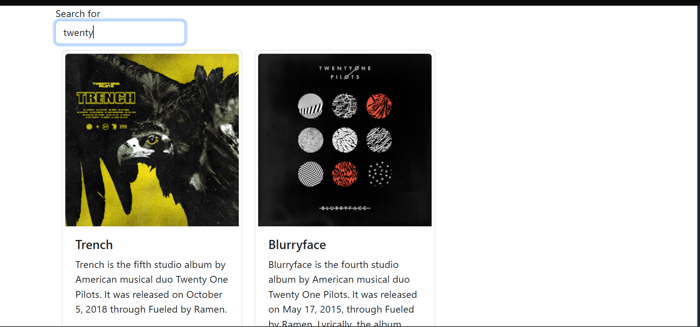
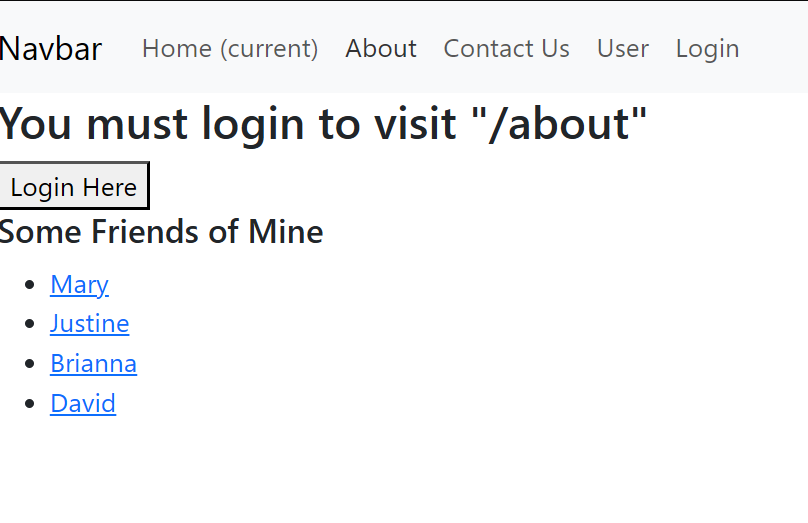
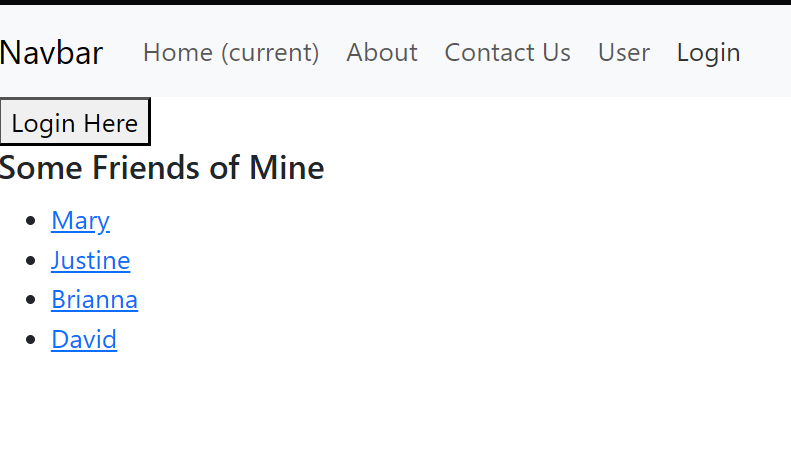
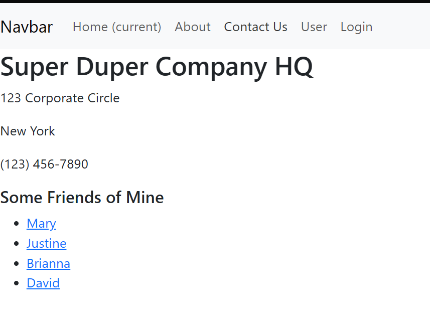
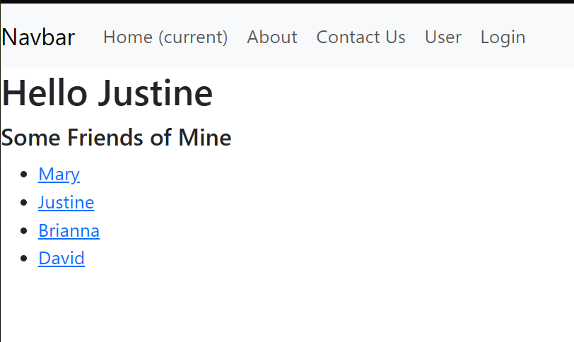
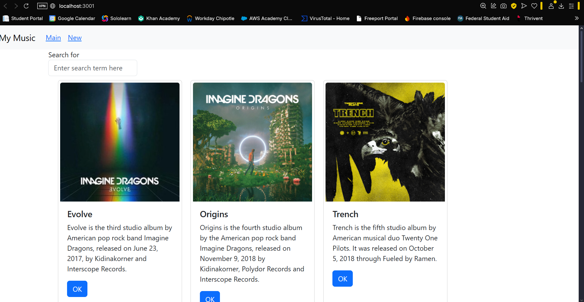
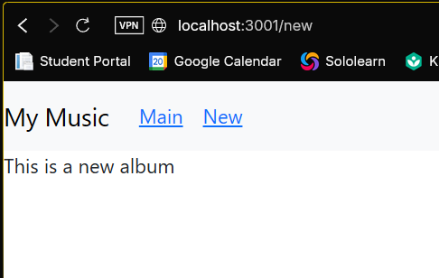
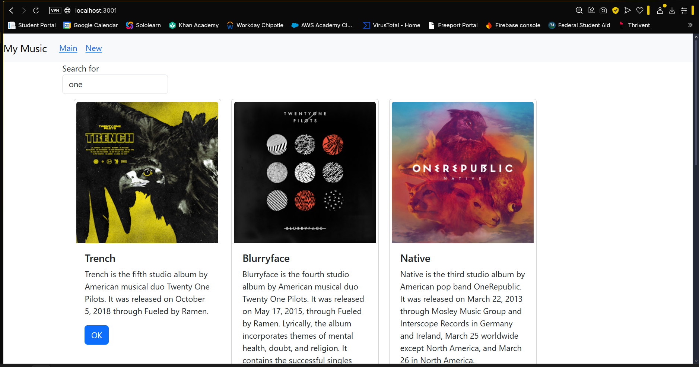

# Activity 6
### Elijah Kremer
### 10 Oct 2025
### CST 391

## Summary

In this session, we advanced the development of our React-based Music application, enhancing both its structure and user experience. The app enables users to search for music albums and view results elegantly displayed in reusable Card components. A key architectural improvement was the refactoring of App.js, which previously handled all state logic, into a set of modular components, boosting maintainability and scalability.
Notably, the app has transitioned from a static setup to a dynamic, route-based navigation system, allowing users to move between views more intuitively. While it’s no longer connected to the original MusicAPI from Activity 1, this shift opens the door for future integration with more robust data sources or third-party APIs like Spotify or Last.fm.
 

## Part 1

This is a screenshot of the application connected to the MusicAPI we created in activity 1.

This shows the search box working and showing only the albums we searched for.

# React Hooks & Component Communication – Lesson Recap

In this lesson, we explored key concepts that power dynamic and responsive React applications. Here's what we covered:

## React Hooks
- **`useState`**: Manages local component state. It returns a state variable and a setter function.
- **`useEffect`**: Handles side effects like API calls. It runs after the component renders and is ideal for tasks like data fetching or subscriptions.

## Component Communication
- **Props**: Used to pass data from parent to child components.
- **Callback Functions**: Allow child components to notify parent components of events or changes—essential for interactive UIs.

## API Integration
- **Axios**: A promise-based HTTP client introduced for making REST API calls.
- **`async/await`**: Used to handle asynchronous operations more cleanly than traditional `.then()` chains, improving readability and error handling.

## Fun Fact
React’s hook system was inspired by functional programming principles—`useEffect` is like giving your component a memory of what to do after it’s been painted on the screen.

## Part 2

This is a screenshot of the about page saying that you must login to visit.

This is the login page of the router application.

This is the contact us page after logging in.

This is one of the user pages.

# React Routing – Lesson Recap

In this lesson, we explored how to implement routing in React using **React Router**, a powerful library for managing navigation in single-page applications.

## Core Concepts

- **Routes**: A route maps a specific URL path to a React component, enabling dynamic rendering based on the browser's address bar.
- **`BrowserRouter`**: The top-level component that wraps the entire app and enables route-based navigation.
- **`useNavigate` & `useLocation`**: React Router hooks that provide access to navigation functions and router state. These hooks only work inside components that are part of a routed context.

## Protected Routes

- **`PrivateRoute`**: A custom component used to protect certain routes from unauthorized access.
  - It redirects unauthenticated users to the `/login` page.
  - It preserves the originally requested path using `location.state`, allowing users to return after logging in.

## Component Nesting

- **`props.children`**: Used within `PrivateRoute` to render nested components. This pattern allows wrapping protected content while maintaining flexibility in layout and structure.

## Summary

# React Router – Key Takeaways

React Router offers a declarative and flexible approach to managing navigation in React applications. It enables developers to build seamless multi-page experiences within a single-page app architecture.

## Why It Matters
- Simplifies route management and URL mapping to components.
- Enhances user experience by enabling dynamic navigation without full page reloads.

## Essential Tools and Patterns
- **`useNavigate`**: A hook that allows programmatic navigation between routes.
- **`useLocation`**: Provides access to the current location object, useful for tracking route state and query parameters.
- **`PrivateRoute`**: A pattern used to protect routes by redirecting unauthorized users to a login page. It often preserves the originally requested path using `location.state`.

Understanding these tools is crucial for building secure, responsive, and user-friendly interfaces in modern React applications.

## Part 3

This is a screenshot of the main application page with the navigation bar.

This is the stud newAlbum page that will be edited in Activity 7.

This is a screenshot of the search bar working in filtering the Albums.

# Component-Based Design & Routing in React – Lesson Recap

This part of the lesson focused on applying **component-based design principles** in React to improve modularity and maintainability.

## Refactoring for Modularity

- The `renderedList` logic in `App.js` was refactored into a standalone component called **`AlbumList`**, which now handles rendering the list of `Card` components.
- A new container component, **`SearchAlbum`**, was introduced to encapsulate both `SearchForm` and `AlbumList`, streamlining the structure and improving separation of concerns.
- `App.js` remains the **stateful parent**, but now delegates display logic and layout responsibilities to its child components.
- This refactor aligns with **React best practices** by breaking the UI into reusable, focused components.

## Conclusion

Key concepts covered in this lesson include:

- **State Management**: Using `useState` to manage dynamic data within components.
- **Side Effects**: Leveraging `useEffect` to handle tasks like data fetching after render.
- **Component Communication**: Passing data via props and using callbacks to send data from child to parent.
- **Reusable Components**: Structuring applications with modular components for better scalability and readability.
- **Routing**: Implementing route-based navigation using React Router.
- **Protected Routes**: Using `PrivateRoute` to restrict access and redirect unauthorized users to `/login`, preserving their intended destination.
- **Data Fetching**: Utilizing `async/await` for cleaner and more readable asynchronous operations.

This lesson emphasized how thoughtful component design and routing strategies contribute to building robust, user-friendly React applications.