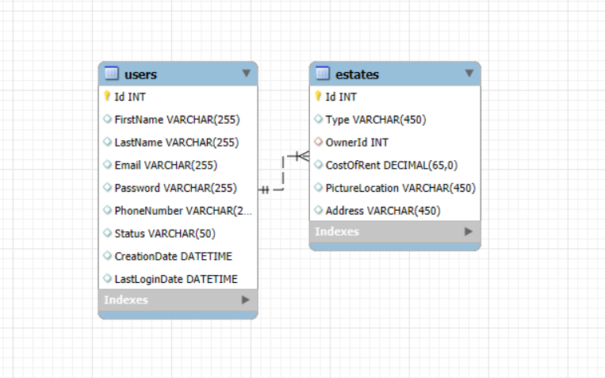
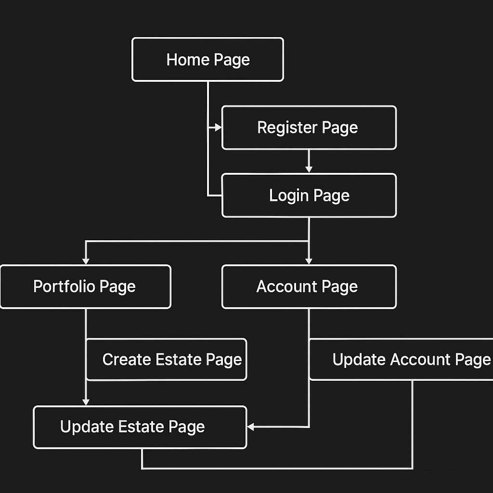
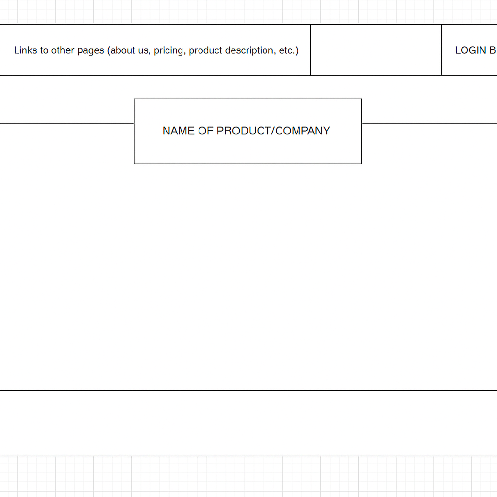
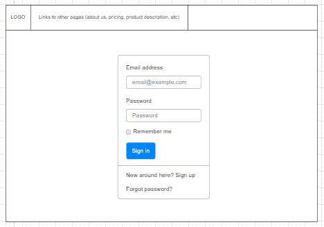
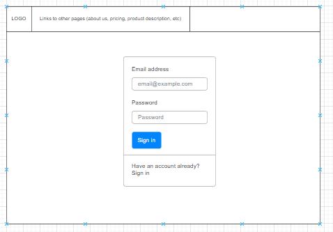
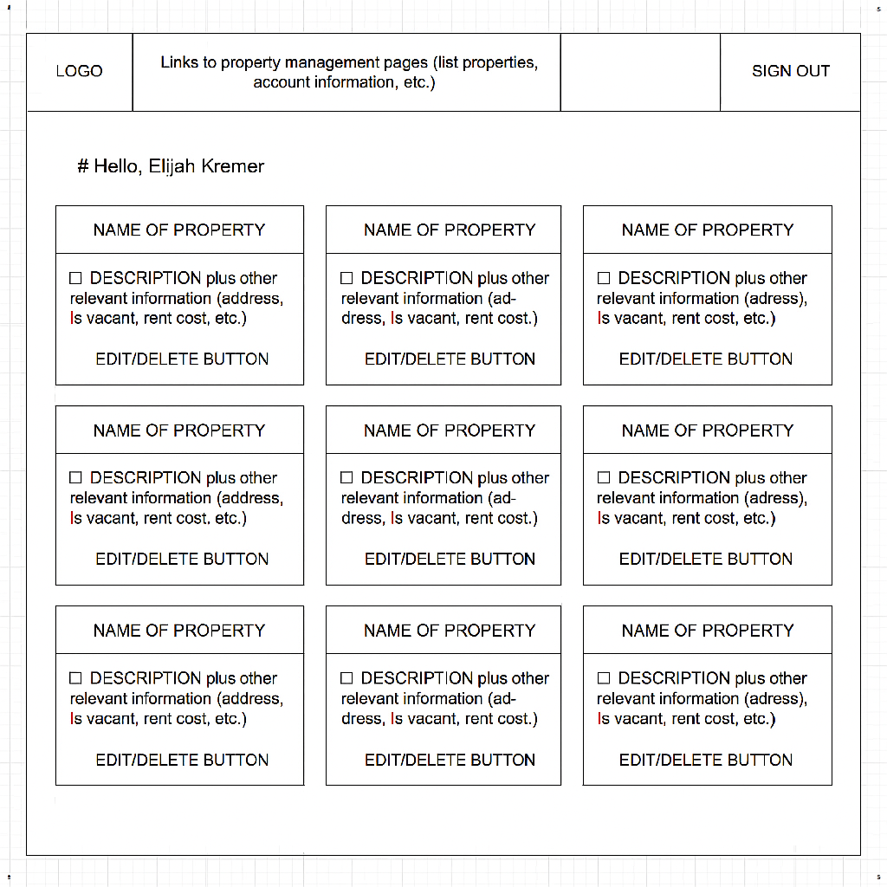
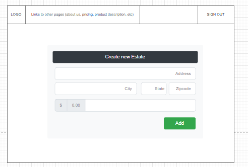
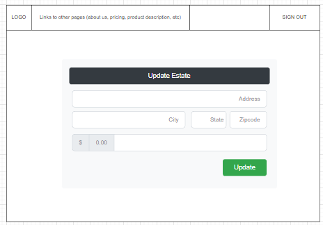
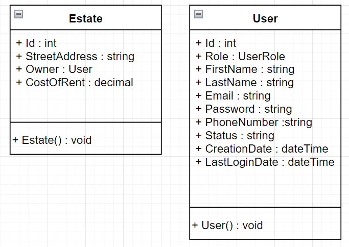

# CST-391 JavaScript Web Development Application 

## Property Management App Proposal

---
### Author: Elijah Kremer
### Date: 6 Sep 2025

---

#### Introduction
This application is designed to help individuals manage the properties they own. For instance, a real estate investor might oversee many assets, ranging from residential homes to apartment complexes and commercial buildings. The platform serves as a hub where owners can handle rent payments, submit and track facility requests, view detailed property information, monitor vacancies, and manage tenant records.
The initial scope of the project focuses on a front-end interface for listing a single type of product: residential properties. The application will support full CRUD functionality, backed by a MySQL database to store and retrieve property data. Users will be required to create an account in order to log in and access their personalized property dashboard.

#### Functional Requirements
Below is a table of initial user Requests for the project:

| **ID** | **User Requests**                                                                                                                    |
| ------ | --------------------------------------------------------------------------------------------------------------------------------- |
| *      | Users want to create an account with a username and password                                                               |
| *      | Users want to log in to the website using my created account                                                               |
| *      | Users want to see a list of all the properties associated with my account                                                  |
| *      | Users want to create new properties that will go into my account                                                           |
| *      | Users want to edit previously created properties                                                                           |
| *      | Users want to delete previously created properties                                                                         |
| *      | Users want to edit important account information                                                                           |
| *      | I want the application to integrate with a MySQL database so that I can perform CRUD operations on property data. |
| *      | I want to ensure all user data is securely stored in the database so that sensitive information is protected.     |
| *     | I want to reset my password in case I forget it so that I can regain access to my account.                             |

#### Database Design
Here is the ER diagram for my database:

#### UI Sitemap
Here is a diagram of how the user will navigate the website:

#### UI Wireframes
Low fidelity wireframes used throughout the application.
##### Home Page

##### Login Page

##### Register Page

##### Portfolio Page

##### Create Estate Page

##### Update Estate Page

#### UML Diagrams

#### Risks
List of the risks and unknown problems that may occur during this project:

| ID  | Risk                                                                                                                                                                    |
| --- | ----------------------------------------------------------------------------------------------------------------------------------------------------------------------- |
| 1   | - Limited familiarity with JavaScript and its associated frameworks may require dedicated time for learning and skill development. |
| 2   | - Challenges may occur when connecting the back-end API to front-end frameworks like React and Angular, including mismatched data formats or incorrect endpoint configurations                                                             |
| 3   | - Managing project milestones alongside other work responsibilities can result in rushed deliverables or incomplete tasks. I will do my best to be on time and well read. |

### Milestone 1 Proposal for Web Development App - Elijah Kremer 
