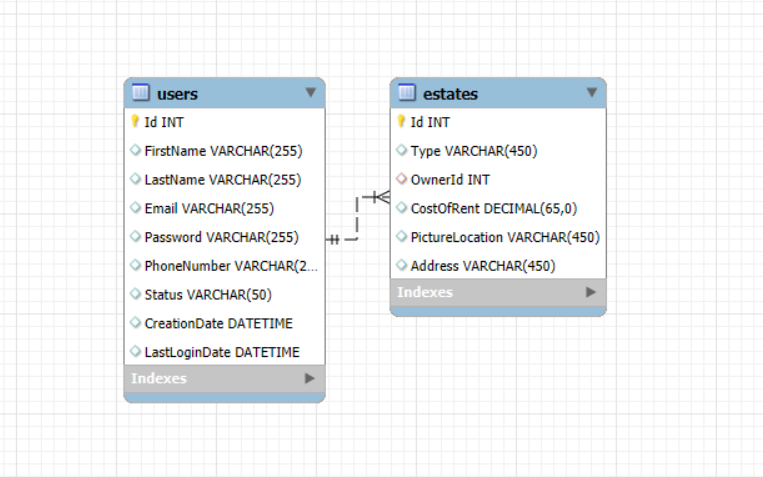
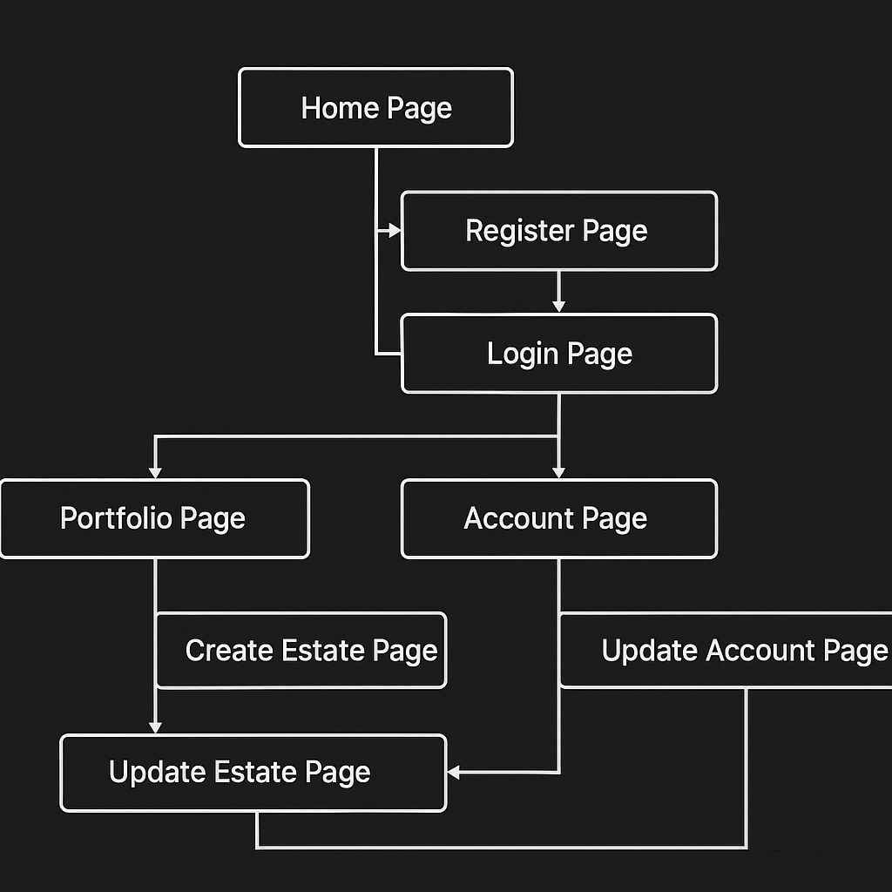
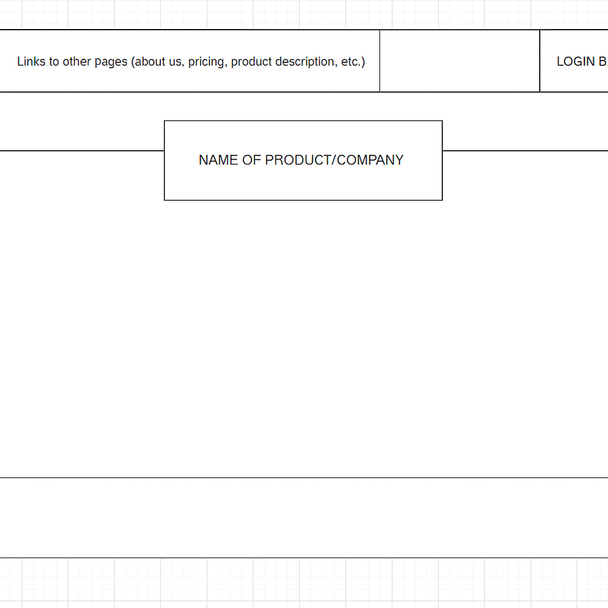
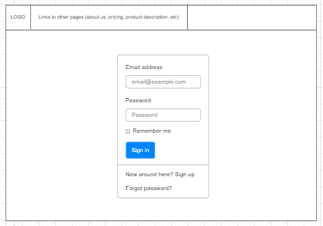
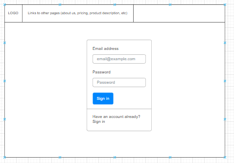
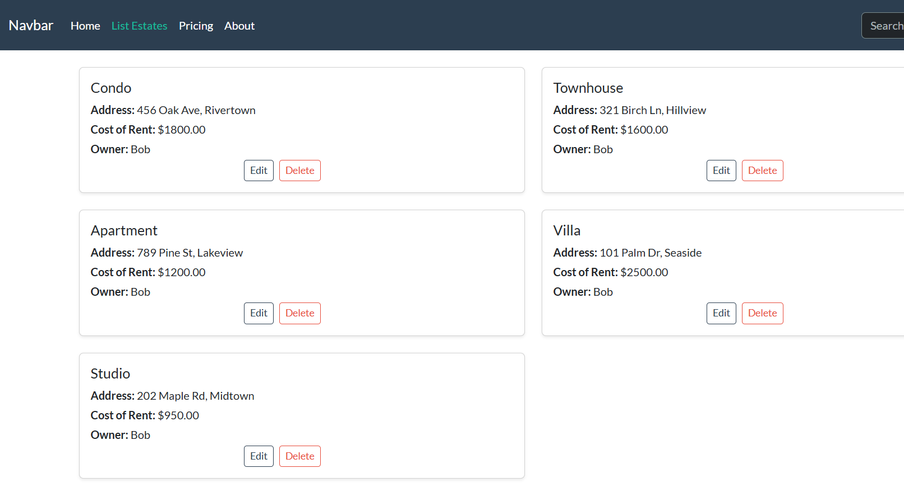
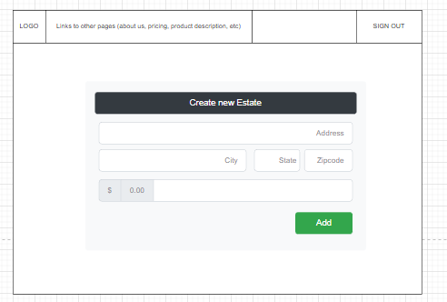
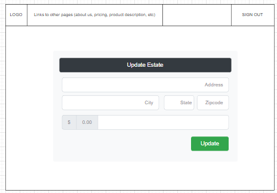
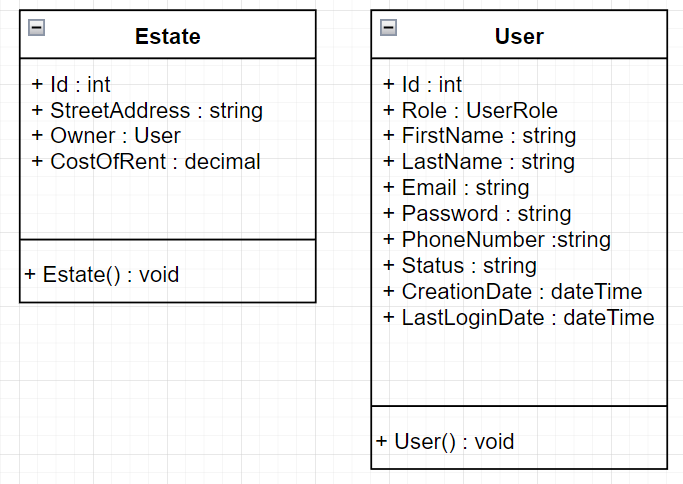

# CST-391 JavaScript Web Application Development

## Property Management Application
### Author: Elijah Kremer
### Date: 12 September 2025
### Screencast URL: [Screencast](https://www.loom.com/share/26d1656b0ac945c08669e94e8096948f)

---

A current issue is that when editing a estate in the angular application is automatically sets the owner id to 1 and not to the original owner.

#### Updates Milestone 3

I've updated the REST API endpoints to accurately represent want is in the application. Please take a look at the API Documentation file for the documentation on the API that was built for this milestone.

### Instructor Feedback: 
"Elijah, here's an update.  Thank you for meeting all requirements on this assignment. First thank you for using Markdown, a Developer's professional approach for documentation of software.

 

Requirements:  Provided an introduction explaining your final project proposal and listing the functional requirements and the Entity-Relationship Diagram explaining your backend database.

 

You also listed the Sitemap your pages that are going to be developed along with the  and the Wireframes of the component structure of your application.

 

There was a Class diagram showing the classes that will be developed.  Finally, the Risks about this project are also mentioned.

 

The only item I see missing is a Conclusion, please add a Conclusion.

 

Nicely done, Bobby"

---

#### Introduction
This application is designed to help individuals manage the properties they own. For instance, a real estate investor might oversee many assets, ranging from residential homes to apartment complexes and commercial buildings. The platform serves as a hub where owners can handle rent payments, submit and track facility requests, view detailed property information, monitor vacancies, and manage tenant records.
The initial scope of the project focuses on a front-end interface for listing a single type of product: residential properties. The application will support full CRUD functionality, backed by a MySQL database to store and retrieve property data. Users will be required to create an account in order to log in and access their personalized property dashboard.

#### Functional Requirements
Below is a table of initial user Requests for the project:

| **ID** | **User Requests**                                                                                                                    |
| ------ | --------------------------------------------------------------------------------------------------------------------------------- |
| *      | Users want to create an account with a username and password                                                               |
| *      | Users want to log in to the website using my created account                                                               |
| *      | Users want to see a list of all the properties associated with my account                                                  |
| *      | Users want to create new properties that will go into my account                                                           |
| *      | Users want to edit previously created properties                                                                           |
| *      | Users want to delete previously created properties                                                                         |
| *      | Users want to edit important account information                                                                           |
| *      | I want the application to integrate with a MySQL database so that I can perform CRUD operations on property data. |
| *      | I want to ensure all user data is securely stored in the database so that sensitive information is protected.     |
| *     | I want to reset my password in case I forget it so that I can regain access to my account.                             |

#### Database Design
Here is the ER diagram for my database:

#### UI Sitemap
Here is a diagram of how the user will navigate the website:

#### UI Wireframes
Low fidelity wireframes used throughout the application.
##### Home Page

##### Login Page

##### Register Page

##### Portfolio Page

##### Create Estate Page

##### Update Estate Page

#### UML Diagrams

#### Risks
List of the risks and unknown problems that may occur during this project:

| ID  | Risk                                                                                                                                                                    |
| --- | ----------------------------------------------------------------------------------------------------------------------------------------------------------------------- |
| 1   | - Limited familiarity with JavaScript and its associated frameworks may require dedicated time for learning and skill development. |
| 2   | - Challenges may occur when connecting the back-end API to front-end frameworks like React and Angular, including mismatched data formats or incorrect endpoint configurations                                                             |
| 3   | - Managing project milestones alongside other work responsibilities can result in rushed deliverables or incomplete tasks. I will do my best to be on time and well read. |

--- 

### REST API
**UPDATED**
These are the URLs for the API methods within this application:

| HTTP Verb   | Endpoint                   | Purpose                                  |
| ----------- | -------------------------- | ---------------------------------------- |
| **Users**   |                            |                                          |
| GET         | `/users`                   | Get list of all users                    |
| GET         | `/users/{email}`           | Get user details by email                |
| GET         | `/users/{userId}`          | Get details of user with ID              |
| POST        | `/users`                   | Create a new user                        |
| PUT         | `/users`                   | Update user details                      |
| DELETE      | `/users/{userId}`          | Delete user by ID                        |
| **Estates** |                            |                                          |
| GET         | `/estates`                 | Get list of all estates                  |
| GET         | `/estates/{id}`            | Get details of estate with ID            |
| GET         | `/estates/owner/{ownerId}` | Get all estates owned by a specific user |
| POST        | `/estates`                 | Create a new estate                      |
| PUT         | `/estates`                 | Update estate details                    |
| DELETE      | `/estates/{id}`            | Delete estate by ID                      |

### Conclusion
My project lays the foundation for a full-featured property management application, combining thoughtful planning with practical implementation. From outlining functional requirements and designing the database schema to mapping user flows and wireframes, each component contributes to a scalable architecture. The inclusion of RESTful API endpoints and UML diagrams ensures that both frontend and backend development will be well-structured and maintainable. While there are some issues related to technical familiarity and time management, I am demonstrating a grasp of core web development principles and a commitment to learning. With continued focus and iteration, this app has the potential to deliver real value to property owners and tenants alike.

