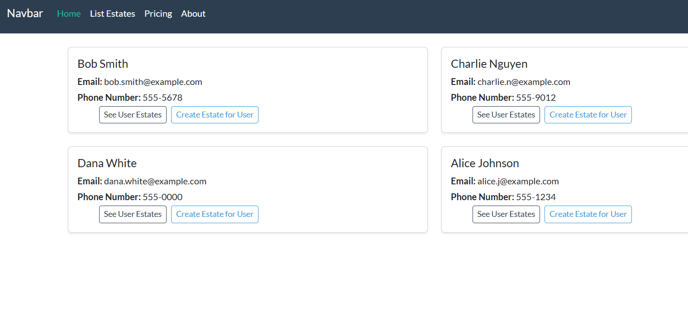
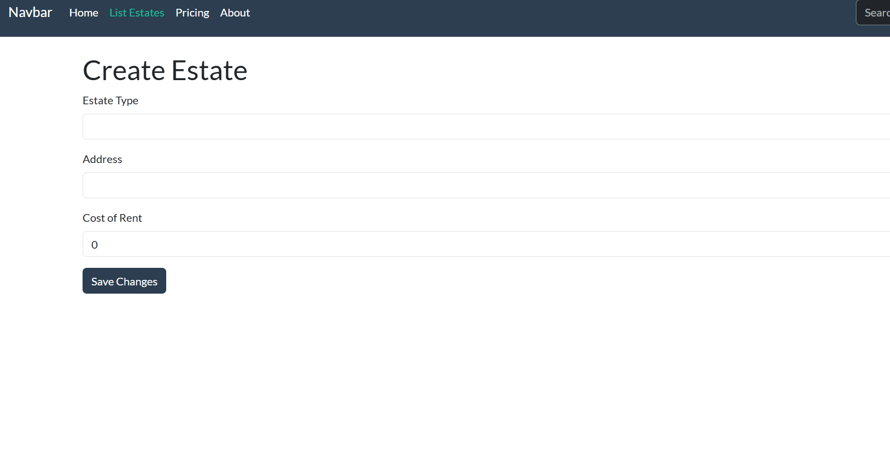
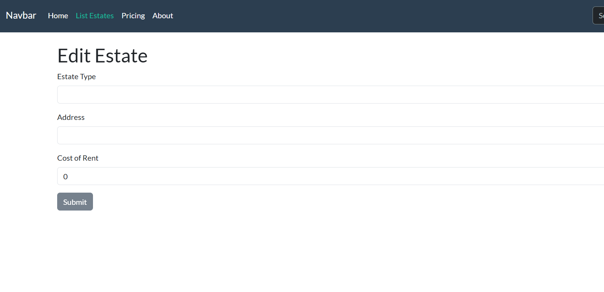

# CST-391 JavaScript Web Application Development

## Property Manager Application
### Author: Elijah Kremer
### Date: 19 Oct 2025
### Link to video: [Demo of Application](https://www.loom.com/share/fdeec7e52a3845bfa2d6388b54406737)
---

#### UPDATES (Milestone 5)
The only major update is the fact that the application is now built using React instead of Angular. 
There are currently no major issues or bugs with the application. 

Link to the Video: [Demo of Application]()

#### Introduction
This application will be used to manage properties a person may own. For example, a real estate inventor may own up to 100 properties, including resident homes, apartment buildings, and commercial buildings. This application can be a singular place for the owner to manage rent payments, facility requests, see property details, track vacancy, and manage tenants. The scope for this project will include a front end to list a singular "product", which is a residential property in this case. There will also be support for all CRUD operations in which the application will be connected to a MySQL database. Users will need to create an account to log in and see their created properties.

#### Functional Requirements
Here is a table of initial user stories for the project:

| **ID** | **User Story**                                                                                                                    |
| ------ | --------------------------------------------------------------------------------------------------------------------------------- |
| 1      | As a user, I want to create an account with a username and password                                                               |
| 2      | As a user, I want to log in to the website using my created account                                                               |
| 3      | As a user, I want to see a list of all the properties associated with my account                                                  |
| 4      | As a user, I want to create new properties that will go into my account                                                           |
| 5      | As a user, I want to edit previously created properties                                                                           |
| 6      | As a user, I want to delete previously created properties                                                                         |
| 7      | As a user, I want to edit important account information                                                                           |
| 8      | As a developer, I want the application to integrate with a MySQL database so that I can perform CRUD operations on property data. |
| 9      | As a developer, I want to ensure all user data is securely stored in the database so that sensitive information is protected.     |
| 10     | As a user, I want to reset my password in case I forget it so that I can regain access to my account.                             |

#### Database Design
Here is the ER diagram for my database:

#### UI Sitemap
Here is a diagram of how the user will navigate the website:

#### UI Wireframes
There are the low fidelity wireframes for all the pages in the application.

##### Home Page

##### Portfolio Page

##### Create Estate Page

##### Update Estate Page

#### Risks
This is a list of the risks and unknowns that could come up during this project:

| ID  | Risk                                                                                                                                                                    |
| --- | ----------------------------------------------------------------------------------------------------------------------------------------------------------------------- |
| 1   | Limited knowledge about the JavaScript language and the frameworks will require time to be spend learning them.                                                         |
| 2   | Balancing milestones with other course requirements or other courses can lead to rushed or incomplete work.                                                             |
| 3   | Issues may arise while integrating the back-end API with the front-end applications (React and Angular), such as mismatched data structures or incorrect API endpoints. |

### REST API
**UPDATED**
These are the URLs for the API methods within this application:

| HTTP Verb   | Endpoint                   | Purpose                                  |
| ----------- | -------------------------- | ---------------------------------------- |
| **Users**   |                            |                                          |
| GET         | `/users`                   | Get list of all users                    |
| GET         | `/users/{email}`           | Get user details by email                |
| GET         | `/users/{userId}`          | Get details of user with ID              |
| POST        | `/users`                   | Create a new user                        |
| PUT         | `/users`                   | Update user details                      |
| DELETE      | `/users/{userId}`          | Delete user by ID                        |
| **Estates** |                            |                                          |
| GET         | `/estates`                 | Get list of all estates                  |
| GET         | `/estates/{id}`            | Get details of estate with ID            |
| GET         | `/estates/owner/{ownerId}` | Get all estates owned by a specific user |
| POST        | `/estates`                 | Create a new estate                      |
| PUT         | `/estates`                 | Update estate details                    |
| DELETE      | `/estates/{id}`            | Delete estate by ID                      |
